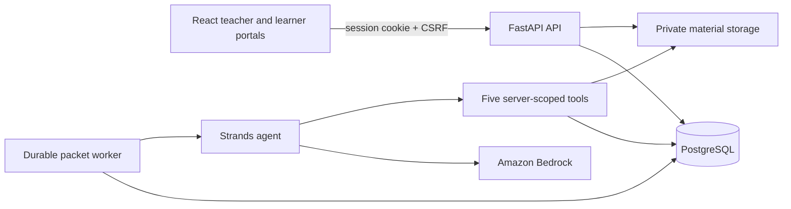

# Class Catch-Up

<div align="center">

### Teacher-reviewed guided-learning grounded in the exact lesson material a learner missed.

[](https://react.dev/)
[](https://www.typescriptlang.org/)
[](https://fastapi.tiangolo.com/)
[](https://aws.amazon.com/bedrock/)
[](LICENSE)

**Built as a source-grounded, teacher-controlled agent workflow**

[Quick start](#quick-start) | [Demo](#demo) | [How it works](#how-it-works) | [Architecture](#architecture) | [Validation](#validation)

</div>

---

## At a glance

| Item | Details |
| --- | --- |
| Product | A guided-learning workflow for a learner who missed a lesson |
| Demo video | [Watch the Class Catch-Up walkthrough](https://youtu.be/IRaRHKPC-sI) |
| Main workflow | Confirm lesson coverage -> generate a cited draft -> teacher review -> publish -> learner completes and requests help |
| AI boundary | Strands agent with five server-scoped tools; teacher approval is always required |
| Evidence | One local Amazon Bedrock Nova 2 Lite packet run over synthetic, teacher-approved material |
| Stack | React, TypeScript, Vite, FastAPI, SQLAlchemy, Alembic, PostgreSQL, Strands Agents SDK, Amazon Bedrock |
| Data policy | The local demonstration contains synthetic school data only |

## The problem

When a learner misses a lesson, catch-up work is often generic or incomplete. A teacher needs to reconstruct what was actually covered, find the right material, create a clear explanation and practice, check it, deliver it, and follow up when the learner gets stuck.

Generic AI worksheets can be quick, but they can lose the essential context: the real class source, the pages actually taught, and the teacher's judgment. The learner studies through AI generated videos, images or texts, submits work, or requests help, the agent also helps as he works

## The solution

Class Catch-Up turns a confirmed absence into a focused, source-grounded catch-up packet. It keeps the model inside teacher-approved lesson material and keeps publication in the teacher's hands.

```text
Teacher uploads lesson material
  -> confirms topics and source pages covered
  -> records the learner's absence
  -> queues a bounded Strands packet job
  -> reviews the cited draft and exact revision
  -> approves and publishes it
  -> learner studies through AI generated videos, images or texts, submits work, or requests help, the agent also helps as he works
```

## How it works

| Stage | What happens | Safety and ownership |
| --- | --- | --- |
| **1. Set up the class** | The teacher selects a class, school-system profile, level, timezone, and learner-facing introduction. | The server validates the selected profile, level, and timezone. |
| **2. Prepare the lesson** | The teacher uploads PDF or TXT material, defines topics, maps them to source segments, confirms coverage, and records attendance. | Only approved topics and segments can be used for generation. |
| **3. Create a draft** | A durable worker uses a bounded Strands workflow to prepare a four-step packet with three checks for understanding. | The agent has only server-scoped tools; it cannot browse, run shell code, or publish work. |
| **4. Review and approve** | The teacher inspects citations, questions, answers, rationales, provenance, and revisions. | Edits create immutable new revisions; approval verifies the exact hash and current lesson state. |
| **5. Support the learner** | The learner opens the assignment as a Watch lesson, visual See map, or Read explanation, then completes work or requests help. | Student APIs do not expose answer keys or teacher rationales; help requests appear in Exceptions. |

## Visual tour

<div align="center">

</div>

### One approved packet, three learner-friendly explanations

Learners choose the format that helps them return to the lesson:

- **Watch**: a paced, playable lesson.
- **See**: a source-linked visual concept map with a readable key.
- **Read**: the full cited explanation.

All three views use the same teacher-approved packet steps and shared completion state; they are not separate, unreviewed AI outputs.

## What makes it different

| Generic catch-up workflow | Class Catch-Up |
| --- | --- |
| Broad worksheet from an open prompt | Packet grounded in teacher-approved source segments |
| AI publishes directly to the learner | Teacher reviews and approves the exact immutable revision |
| Citations may be absent or unreliable | Deterministic validation checks source membership, excerpts, pages, and packet structure |
| One generic explanation | Watch, See, and Read views derived from one approved packet |
| Failures can look like success | Provider and worker failures remain visible; fixture content has explicit provenance |
| Learner progress lives only in the browser | Server-owned progress, submission, and help-request state |

## Demo

### Video walkthrough

Watch the project demo on YouTube: **[Class Catch-Up demo video](https://youtu.be/IRaRHKPC-sI)**.

The walkthrough follows the intended teacher-to-learner journey:

1. Set up the teacher and class context.
2. Confirm the material, topics, pages, and an absence.
3. Inspect a packet draft and its provenance.
4. Approve the exact revision.
5. Open the learner assignment, complete work, and request help.
6. Return to the teacher Exceptions view to resolve the request.

### Local demo behavior

The local demo opens directly to teacher school setup; it intentionally has no credential form in the presentation journey. The persistent role drawer switches between the synthetic Teacher and Student views, while server-side tenant, role, class, and enrollment checks remain in force.

A first-time browser receives a distinct synthetic learner and an untouched assignment. Reloading that browser restores its server-side progress; another browser begins with a separate learner record.

> **Honest demo note:** The demonstration uses synthetic school data. One local model-driven Strands run used Amazon Bedrock Nova 2 Lite and is recorded in [`artifacts/runtime-spike/bedrock-strands-packet-run.json`](artifacts/runtime-spike/bedrock-strands-packet-run.json). This is not a claim of durable production deployment, real student usage, or measured learning impact.

## Architecture



### Trust boundaries

- The server derives tenant, teacher, class, enrollment, and learner scope from the authenticated session.
- Materials are evidence, not instructions. The agent can read only confirmed lesson context and approved material segments.
- The workflow exposes five scoped tools: read confirmed lesson data, retrieve approved segments, validate a packet, save a draft, and flag a content gap.
- Deterministic code—not the model—owns authorization, citation validation, packet approval, and publication.
- Publication creates an assignment only after the teacher approves the exact current packet revision and hash.
- Student source access is limited to segments cited by that learner's active, published assignments.

For the complete design, read the [architecture guide](docs/architecture.md) and the [implementation status](IMPLEMENTATION_STATUS.md).

## Tech stack

| Layer | Technology |
| --- | --- |
| Teacher and learner portal | React 19, TypeScript, Vite |
| API and authorization | FastAPI, server-stored sessions, CSRF protection |
| Data and migrations | SQLAlchemy, Alembic, PostgreSQL 17 |
| Local verified test path | SQLite |
| Materials | Private filesystem storage; UTF-8 TXT and text-based PDF extraction |
| Agent workflow | Strands Agents SDK with Amazon Bedrock |
| Model evidence | Amazon Nova 2 Lite completed one recorded local packet run |
| Quality checks | Pytest, Python compilation, Oxlint, TypeScript, Vite |
| Deployment package | Docker multi-stage build running the API and durable worker on one origin |

## Quick start

### Prerequisites

- `uv` with Python 3.13
- Docker and Docker Compose for the reference PostgreSQL setup
- Node.js 24 LTS or Bun 1.4+
- Optional for live generation: AWS credentials with Bedrock invocation permission, a model available to the account, and its region

### 1. Configure the local environment

Copy [`.env.example`](.env.example) to `.env`. For the supplied Compose database, ensure `DATABASE_URL` uses the same local password configured in [`infra/compose.yaml`](infra/compose.yaml). The checked-in Compose password is development-only.

For a model-driven run, set the following using the normal AWS credential chain; do not commit credentials:

```text
AWS_REGION=<enabled-region>
BEDROCK_MODEL_ID=<model-available-in-your-account>
```

### 2. Start the API and seed synthetic data

```powershell
docker compose -f infra\compose.yaml up -d postgres
uv sync --directory services\api
uv run --directory services\api python -m alembic upgrade head

$env:DEMO_TEACHER_PASSWORD = "<choose-local-password>"
$env:DEMO_STUDENT_PASSWORD = "<choose-local-password>"
uv run --directory services\api python scripts\generate_fraction_fixture.py
uv run --directory services\api python -m app.seed

uv run --directory services\api python -m uvicorn app.main:app --host 127.0.0.1 --port 8000
```

The seed creates only synthetic identities: `teacher.demo` and one learner account for each of Ada, Bola, Chidi, Dami, Eniola, and Femi. Passwords come from the environment variables and are never embedded in the client build.

### 3. Start the packet worker

In a second terminal:

```powershell
uv run --directory services\api python -m app.worker
```

Without valid Bedrock configuration, the worker records a visible `provider_not_configured` retry state and creates no packet. It does not substitute fixture output for a provider failure.

### 4. Start the web client

In a third terminal:

```powershell
cd apps\web
bun install
bun run dev
```

Open `http://127.0.0.1:5173`. The Vite client proxies `/api` requests to `http://127.0.0.1:8000`.

If Node is healthy in the local environment, `npm install` and `npm run dev` are equivalent alternatives.

## Run with Docker

The root [`Dockerfile`](Dockerfile) builds the web client, applies migrations, initializes synthetic data only when the database is empty, starts the durable worker, and serves FastAPI plus the built client on one origin.

```powershell
docker build -t class-catch-up .
docker run --rm -p 8080:8080 `
  -e AWS_REGION=us-east-1 `
  -e BEDROCK_MODEL_ID=us.amazon.nova-2-lite-v1:0 `
  -v class-catch-up-data:/data `
  class-catch-up
```

For a public demonstration, retain `APP_ENVIRONMENT=production`, `DEMO_MODE=true`, and `COOKIE_SECURE=true`; mount `/data` for durable SQLite demo state or configure a managed PostgreSQL database. Use a workload IAM role with only the required Bedrock invocation permission—never bake long-term AWS credentials into an image or this repository.

## Validation

Run the available project checks:

```powershell
uv run --directory services\api python -m pytest -q
uv run --directory services\api python -m compileall -q app migrations spikes
cd apps\web
bun run lint
bun run build
```

The latest recorded local verification includes:

- **24 backend tests passed.**
- **Python source compilation passed.**
- **Oxlint, TypeScript, and the Vite production build passed.**
- **A local Strands custom-tool execution and one Bedrock-backed packet run were recorded over synthetic material.**

Reproduce the local custom-tool evidence with:

```powershell
uv run --directory services\api python spikes\strands_tool_spike.py
```

Read [evaluation evidence](docs/evaluation.md) for the acceptance matrix and its stated limitations.

## Project documentation

| Document | Purpose |
| --- | --- |
| [Setup guide](docs/setup.md) | Prerequisites, configuration, local startup, and validation |
| [Architecture](docs/architecture.md) | Runtime components, trust boundaries, and the durable workflow |
| [Demo script](docs/demo.md) | A concise recording plan and claim guidelines |
| [Evaluation](docs/evaluation.md) | Automated results, acceptance coverage, and browser evidence |
| [Known limitations](docs/limitations.md) | Product, provider, security, and deployment limitations |
| [Implementation status](IMPLEMENTATION_STATUS.md) | Verified implementation work, evidence, and remaining blockers |
| [UI reference](UI_INFO.md) | Teacher and learner interface contract |

## License

This project is available under the [MIT License](LICENSE).
