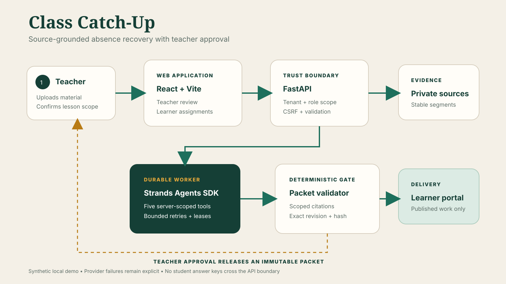

# Class Catch-Up

Class Catch-Up is a teacher-reviewed absence catch-up agent. The current implementation is local-development software built from the accompanying implementation plan.

Teachers begin with a persisted school setup: introduce themselves, choose a class, and select either United States High School or England & Wales Secondary / Sixth Form. The selected profile controls grade/year choices, timezone choices, and period/lesson terminology.

## Truthful runtime status

- A real local Strands SDK custom tool call has run successfully. See `artifacts/runtime-spike/strands-tool-call.json`.
- A model-driven local Strands run invoked Amazon Nova 2 Lite through Bedrock, used four scoped tools, passed deterministic validation, and saved a teacher-review draft. See `artifacts/runtime-spike/bedrock-strands-packet-run.json`.
- The teacher then approved that exact draft and delivered it to a synthetic learner in the local browser journey.
- No deployment, real student data, external messaging, or learning-impact claim exists.

## Review improvements (September 13)

Teachers now select named topics and source pages, restore saved attendance, review every quiz answer and rationale, and edit a new packet revision before publication. Learners can restore progress, submit completed work, and request help that teachers can resolve. The worker has supervised time limits and lease renewal.

Learners can open each published packet as a paced Watch lesson, a source-linked visual map, or a full Read explanation. All three modes use the same teacher-approved packet steps and completion state.

The development demo isolates learner progress by browser. A first-time visitor receives one synthetic assignment marked `Not opened`; reloads keep that visitor's server-side progress, while a new browser starts with a fresh synthetic learner record.

See `IMPLEMENTATION_STATUS.md` for verified behavior and remaining external blockers.

Future coding agents should begin with `AGENTS.md`. The current teacher/student journeys and visual contract are documented in `UI_INFO.md`.

The active web client uses the imported Kimi Class Management interface. Teacher pages run from `index.html`, learner assignments from `students.html`, and both use the FastAPI backend through the Vite `/api` proxy; the downloaded prototype's `localStorage` data layer is not used.

## Backend setup

Requirements:

- `uv` with Python 3.13
- Node.js 24 LTS or Bun 1.4+
- Docker with Compose for the PostgreSQL path

Copy `.env.example` to `.env` and replace the local database password to match your Compose configuration.

```powershell
docker compose -f infra\compose.yaml up -d postgres
uv sync --directory services\api
uv run --directory services\api python -m alembic upgrade head
$env:DEMO_TEACHER_PASSWORD = "<local-only-password>"
$env:DEMO_STUDENT_PASSWORD = "<local-only-password>"
uv run --directory services\api python -m app.seed
uv run --directory services\api uvicorn app.main:app --reload
```

The seed command creates only synthetic demo identities. It refuses to use embedded/default passwords and refuses to reseed the same synthetic tenant.

On first launch, the local demo opens directly on teacher school setup. Its role drawer switches between the seeded Teacher and Student experiences without a credential form. The teacher introduction is then shown to enrolled learners. “England & Wales” is a terminology/profile choice, not a claim that all European school systems are uniform.

Run the durable packet worker in a second terminal:

```powershell
uv run --directory services\api python -m app.worker
```

Run the web client in a third terminal:

```powershell
cd apps\web
bun install
bun run dev
```

The development client proxies `/api` to `http://127.0.0.1:8000`. Use `npm install` and `npm run dev` instead if Node is healthy.

## Container deployment

The root `Dockerfile` builds the two-page React client and serves it with the FastAPI API on one origin. On startup it applies migrations, initializes the synthetic demo only when the database is empty, starts the durable packet worker, and listens on `PORT` (default `8080`).

```powershell
docker build -t class-catch-up .
docker run --rm -p 8080:8080 `
  -e AWS_REGION=us-east-1 `
  -e BEDROCK_MODEL_ID=us.amazon.nova-2-lite-v1:0 `
  -v class-catch-up-data:/data `
  class-catch-up
```

For a public demo, keep `APP_ENVIRONMENT=production`, `DEMO_MODE=true`, and `COOKIE_SECURE=true`. Mount `/data` for durable SQLite demo state, or replace `DATABASE_URL` with a managed PostgreSQL connection. Give the workload an AWS IAM role with only the required Bedrock model invocation permission; do not copy long-term AWS access keys into the image or repository.

## Focused validation

```powershell
uv run --directory services\api python -m pytest -q
uv run --directory services\api python -m compileall -q app migrations spikes
cd apps\web
bun run lint
bun run build
```

The local Strands tool spike is reproducible with:

```powershell
uv run --directory services\api python spikes\strands_tool_spike.py
```

Its output distinguishes the custom-tool-only spike from fixture data and from the separate Bedrock-backed packet run.

See `docs/setup.md`, `docs/architecture.md`, `docs/evaluation.md`, `docs/limitations.md`, and `docs/demo.md` for the complete handoff.


