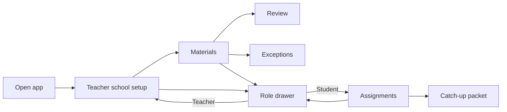

# Class Catch-Up UI Reference

This document is the interface contract for agents editing the Class Catch-Up web client. The Kimi frontend is now integrated in `apps/web/src/App.tsx`, `Setup.tsx`, `Roster.tsx`, and `styles/`. Its former browser-only store has been replaced by calls through `src/lib/api.ts` to the existing FastAPI backend.

## Experience model

The demo has one entry URL and two role-specific experiences. It does not show an authentication page.

The backend still creates a scoped development session for the selected synthetic role. The missing credential screen is a presentation choice, not permission to remove server-side role or tenant checks.

## First screen: teacher school setup

The first page is a two-part editorial layout.

The introduction area contains:

- Class Catch-Up brand.
- `Welcome, teacher` eyebrow.
- “Make catch-up feel like it belongs in your school.” heading.
- A short explanation of the setup.
- The Teacher role button that opens the role drawer.

The setup form contains:

- Teacher display name.
- Learner-facing introduction.
- Class selection.
- United States High School or England & Wales Secondary / Sixth Form selection.
- Grade/year selection controlled by the selected school system.
- School timezone.
- A compact experience preview.
- `Enter my class` as the primary action.
- `Cancel` only when a previously completed setup is being revisited.

Successful submission opens Materials. Show errors directly above the action row in plain language. Do not expose raw proxy responses such as “Bad Gateway.”

## Role drawer

The small circular T or S control is the persistent role entry point. Activating it opens a right-side drawer over a dimmed scrim.

The drawer contains:

- Clear “Choose your view” context.
- Teacher option: setup, packet review, and learner follow-up.
- Student option: catch-up assignments, practice, and help requests.
- A visible note that demo data is synthetic.
- A close button and a clickable scrim.

Selecting a role closes the drawer and switches immediately. Teacher always returns to school setup first. Student opens Assignments. Keep the control keyboard accessible and expose its expanded state.

## Teacher interface

After setup, the teacher header shows the Class Catch-Up brand, selected class, school-system badge, teacher name, and role control.

Teacher navigation:

| Destination | Purpose |
| --- | --- |
| Materials | Upload PDF/TXT sources, define topic sequence, inspect extracts, approve mappings, and queue one source-grounded catch-up job for an absent learner. |
| Review | Inspect generated packet content, citations, answers, rationales, revisions, and publication state. |
| Exceptions | Resolve missing evidence, failed preparation, and learner help requests. |
| School Setup | Reopen teacher, class, school-system, year, and timezone settings. |

The Today page is intentionally absent from current navigation. Do not restore it without an explicit product decision and a complete flow review.

The Materials page contains the compact replacement for the former daily trigger. “Prepare catch-up” records the selected lesson date and period, uses only approved topic mappings, records one selected synthetic learner absent, records the remaining roster present, and queues the durable Strands packet job. A queued state is not a successful model run; Review must show `STRANDS RUN` before the packet can be described that way.

Each teacher workspace page ends with a sequential hand-off: Materials continues to Review, Review continues to Exceptions, and Exceptions opens the Student view. Keep these bottom actions visible after the page content and label the destination explicitly.

## Student interface

The student experience opens on Assignments. It may show the teacher introduction and school context, followed by assignment cards. In development demo mode, each browser receives its own synthetic learner and one untouched assignment. `Not opened`, `Opened`, `In progress`, and `Submitted` are plain-language views of server-owned assignment state. Progress persists for that browser, while a browser without the demo visitor cookie starts fresh.

Opening an assignment first offers three explanation formats derived from the same approved packet content: Watch is a paced, playable lesson; See is an SVG concept map with a readable key; Read is the full source-linked lesson. All three formats preserve the packet citations and share the same explicit step-completion state. Questions follow the explanation. Student APIs must omit answer keys and teacher rationale. Progress must restore after reload. Submission requires all required steps and questions. Help requests should be visible to the teacher in Exceptions.

## Visual language

- Direction: warm editorial school workspace.
- Base: warm paper background with off-white cards.
- Anchor color: restrained honey/gold.
- Supporting colors: warm neutrals, positive green, and muted red for errors.
- Display and interface typography: locally bundled Geist and Geist Mono.
- Surfaces: thin warm borders, moderate corner radius, and quiet shadows.
- Layout: generous desktop spacing that collapses to one column on tablets and phones.
- Motion: minimal and functional. Respect reduced-motion preferences if animation is introduced.

Avoid generic dashboard decoration, gradients, emoji feature icons, nested cards, invented metrics, and unexplained success celebrations. Keep accents sparse and let hierarchy come from typography and spacing.

## Responsive requirements

- Support 320, 375, 414, 768, and desktop widths.
- Keep `overflow-x: clip` on both `html` and `body`.
- Use `minmax(0, 1fr)` for narrow grid tracks.
- Keep display headings wrappable with `min-width: 0` and `overflow-wrap: anywhere`.
- Prevent button and navigation labels from wrapping.
- On widths at or below 900 px, school setup becomes one column.
- On narrow phones, the role drawer occupies the available width and the role trigger may collapse to its circular letter and menu mark.

## Accessibility requirements

- Every field has a visible label.
- Interactive controls provide hover, focus-visible, active, and disabled states where applicable.
- Focus indicators must appear immediately and remain visible against the surface.
- Drawer controls expose `aria-expanded`; the drawer and close controls have accessible names.
- Do not communicate state using color alone.
- Errors stay close to the affected action and use actionable wording.
- Maintain at least WCAG AA contrast for text and controls.

## UI verification checklist

Before reporting UI work complete:

- Load `/` in a clean browser session.
- Confirm teacher setup is the first useful screen.
- Confirm no login, password, or Today navigation appears.
- Submit school setup and confirm Materials loads.
- Open the role drawer from both experiences.
- Switch Teacher to Student and Student to Teacher.
- Open a student assignment when seeded data provides one.
- Check browser console and failed network requests.
- Check 320, 375, 414, and 768 px for clipping and horizontal overflow.
- Run `npm run lint` and `npm run build` from `apps/web`.

## Truthful demo language

Safe labels include “synthetic demo data,” “fixture-generated packet,” “tested locally,” and “provider not configured.” Use “model generated” or “live Bedrock run” only when current runtime evidence proves that exact path. A polished interface, passing build, or successful fixture journey does not prove deployment or a live provider integration.
