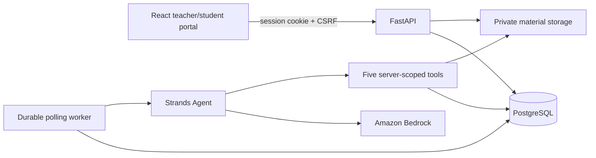

# Architecture

## Runtime components

- `apps/web`: React 19, TypeScript, and Vite. It contains teacher Today/material/mapping/review/exception screens and the student assignment flow.
- `services/api/app`: FastAPI routes, SQLAlchemy models, session authentication, material extraction, packet validation, and the worker.
- `services/api/migrations`: ordered Alembic migrations.
- `infra/compose.yaml`: PostgreSQL 17 for local development.
- Private files are accessed through `LocalPrivateStorage`; browser clients receive authorized excerpts through `/sources/{segment_id}`, never storage paths.

## Trust boundaries

- The server derives tenant, teacher, class, enrollment, and student scope from the authenticated session.
- Login identifiers are globally unique. Passwords are Argon2-hashed.
- Session tokens are random, stored only as SHA-256 hashes, and sent in HttpOnly SameSite cookies.
- Writes require the matching per-session CSRF token.
- Teacher class queries require both tenant and owner-teacher identifiers.
- Student queries resolve the enrollment's opaque `student_id` and never accept it as an authorization claim.
- A source segment is available to a student only when it is cited by one of that student's active, published assignments.

## Territory-aware experience

- Teacher onboarding persists an introduction and selected class.
- A class can use `united_states_high_school` or `england_wales_secondary`.
- The US profile allows Grades 9-12, four common continental-US timezones, and Period terminology.
- The England & Wales profile allows Years 7-13, `Europe/London`, and Lesson terminology.
- The API validates that the selected level and timezone belong to the selected system.
- Students receive the selected school-system label, level, and teacher introduction through an enrollment-scoped endpoint.
- This layer adapts terminology and setup; it does not infer curriculum standards or treat all European countries as one system.

## Durable packet workflow

1. A teacher saves exact class/date/period coverage and attendance with an idempotency key and expected lesson revision.
2. The transaction writes attendance, revision, audit event, idempotency receipt, and at most one packet job.
3. The worker claims a job with row locking and a lease. Expired leases can be reclaimed. Attempts are capped at three with backoff.
4. One Strands agent receives only server-bound lesson context and five tools:
   - `read_confirmed_lesson`
   - `retrieve_material_segments`
   - `validate_packet`
   - `save_packet_draft_tool`
   - `flag_content_gap`
5. The agent has no shell, Python execution, browser, or auto-discovered tools. Bedrock calls have connect/read timeouts, one provider retry, and turn/token limits.
6. Deterministic validation checks schema, source membership, exact supporting excerpts, question structure, and stable IDs.
7. Teacher edits create a new immutable revision. Approval checks the exact revision, content hash, lesson revision, current absence, and enrollment.
8. Publication and assignments commit together. Attendance correction withdraws active assignments without deleting progress.

## Data truth labels

- `AgentRun.generation_run_id` identifies model-driven packet revisions.
- Packets without a generation run are returned as `fixture_or_teacher_edit`.
- Provider failures remain failed/retry states and cannot create a successful packet.
- Direct excerpts and generated explanations have different `content_kind` values.
